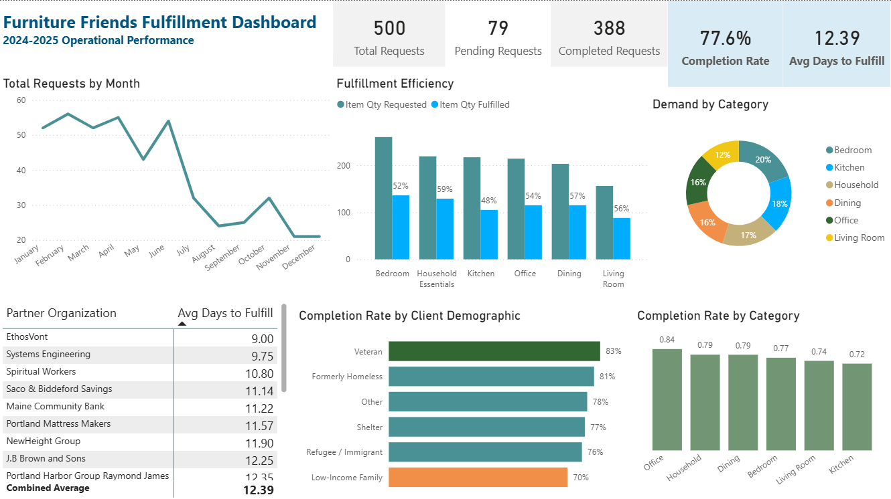
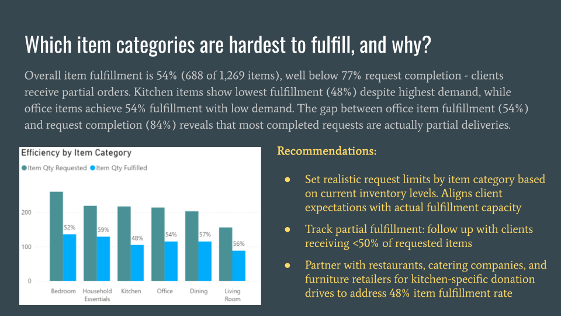

# Furniture Bank Fulfillment Analysis

## Project Overview
Analysis of 500+ fulfillment requests for a nonprofit furniture bank to identify operational bottlenecks and optimize completion rates and inventory.

## Business Questions Addressed
- When does demand peak, and how should staffing align?
- Which item categories are undersupplied vs oversupplied?
- Are all partner organizations performing at similar efficiency?
- Are we serving all client demographics equitably?

## Key Findings
- 69% of requests occur January-June, but staffing and volunteers are flat year-round
- Kitchen requests show lowest completion rate (71%) while office items are oversupplied (84%)
- Item fulfillment for kitchen requests is 48%, 6 points below the 54% average, indicating chronic supply shortage
- Partner org fulfillment time varies from 9-15 days despite similar volumes, although completion rates are not consistent
- 13-point completion rate gap between veterans (83%) and low-income families (70%)

## Tools & Skills
- **Power BI**: Interactive dashboard with drill-down by month, category, partner org, demographics
- **Data Modeling**: Created schema with relationships across fulfillment, inventory, and client data
- **Business Analysis**: Translated data insights into actionable operational recommendations

## Files in This Repository
-  - Power BI dashboard file
-  - Executive presentation with data breakdown and recommendations
-  - Sample dataset (500 fulfillment requests, 1269 items)

## Dashboard Preview

## Sample Insights Slide

## How to Use
1. Download the `.pbix` file
2. Open in Power BI Desktop (free download from Microsoft)
3. Explore interactive filters and drill-downs

## About This Project
This was a portfolio project demonstrating my ability to:
- Analyze operational data to identify inefficiencies
- Build executive-ready dashboards and presentations
- Provide data-driven recommendations that drive business outcomes

## Purpose and Inspiration
- Framework designed for nonprofit furniture banks and similar operations-focused organizations. 
- Mock data used to demonstrate capabilities; methodology applicable to real operational datasets.

**Available for similar projects.** Contact: elliotdumais37@gmail.com
